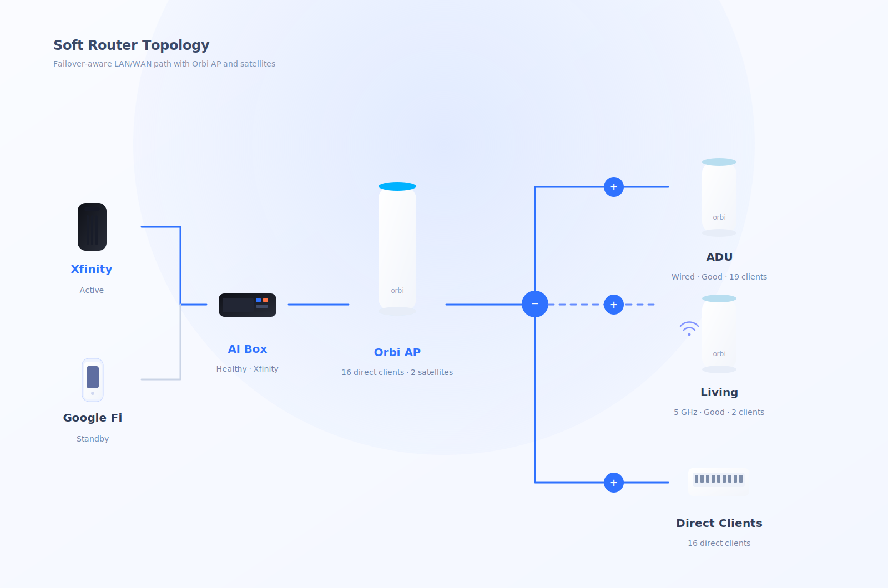

# orbi-monitor-core

Build your own Orbi observability stack without depending on the stock UI.

`orbi-monitor-core` is a backend-first toolkit for Netgear Orbi networks. It gives you:

- structured router and satellite state from hidden AJAX and SOAP endpoints
- normalized attached-client data for your own dashboards and automations
- optional host-side throughput estimation
- optional native per-device traffic telemetry using `tc + eBPF + libbpf`
- optional Linux failover policy control for primary/secondary WAN routing
- failover-aware output that can carry active uplink metadata into the same payload as device telemetry

It is designed for people who want raw data, stable schemas, and code-level control.



## Why this project exists

Orbi exposes useful state, but not in a form that is easy to reuse. The stock UI is fine for manual checks, but weak if you want to:

- build a custom dashboard
- export data into Prometheus, SQLite, or your own APIs
- automate alerts and topology checks
- compare WAN throughput against node-side probe throughput
- add Linux-side network telemetry when Orbi is running as `AP mode`

This project turns those hidden router responses into a clean Python API and CLI, then adds an optional native collector for real routed device traffic.

## What you get

- Internet status from `POST /ajax/basicStatus.cgi`
- attached device inventory from `POST /ajax/get_attached_devices`
- router metadata from hidden SOAP actions such as `GetInfo`
- support feature map from `GetSupportFeatureListXML`
- satellite inventory and backhaul state
- per-device fields such as:
  - `ConnectedOrbi`
  - `SSID`
  - `Linkspeed`
  - `SignalStrength`
- parsed raw response sources for debugging and reverse engineering
- optional local throughput estimate with `ping + iperf3 + speedtest`
- optional Linux failover controller that can:
  - monitor primary and backup uplinks
  - switch route preference with metrics
  - emit structured upstream status JSON
- optional native device traffic collector that exports:
  - live `download_bps`
  - live `upload_bps`
  - per-device daily totals
- optional upstream block in normalized traffic output so your dashboard can show:
  - active uplink
  - failover state
  - last switch reason

## Architecture

The repository is intentionally split into two layers:

- `orbi_monitor_core.client`
  - AJAX + SOAP collector
  - normalizes Orbi router, satellite, and client state
- `native/device_traffic`
  - Linux-only collector
  - attaches `tc` eBPF programs on the LAN interface
  - reads pinned maps through `libbpf`
  - exports snapshots over a Unix domain socket
- `orbi_monitor_core.failover`
  - Linux-only failover controller
  - resolves uplinks from NetworkManager
  - health-checks WANs with ICMP
  - switches route preference using `ip route`
  - emits upstream/failover JSON for dashboards

That separation keeps the Orbi collector reusable even if you do not want the Linux traffic telemetry layer.

## Supported hardware

Verified against:

- `RBR750`
- `RBS750`
- firmware `V7.2.8.2_5.1.18`

Other Orbi models may work if they expose the same AJAX and SOAP actions.

## Install

```bash
python3 -m venv .venv
. .venv/bin/activate
pip install -e .
```

Native collector build prerequisites:

- `clang`
- `llvm`
- `libbpf-dev`
- `libelf-dev`
- Linux headers matching the running kernel

## Quick start

Collect Orbi router state:

```bash
orbi-monitor-core \
  --host http://192.168.1.1 \
  --username admin \
  --password 'your-router-password' \
  --target-satellite-name satellite-a \
  --throughput-probe-host 192.168.50.10 \
  --pretty
```

Read native device traffic from the Unix socket:

```bash
orbi-monitor-device-traffic \
  --socket-path /run/orbi-monitor-core/device-traffic.sock \
  --dashboard-json ./snapshot.json \
  --upstream-json ./upstream.json \
  --pretty
```

Generate `upstream.json` with the built-in failover controller:

```bash
orbi-monitor-failover \
  --primary-connection "Wired connection 1" \
  --failover-connection "Wired connection 2" \
  --mode status \
  --pretty > upstream.json
```

Example `upstream.json`:

```json
{
  "checked_at": "2026-03-17T20:00:03Z",
  "mode": "failover_wan",
  "active_label": "Secondary WAN",
  "last_switch_at": "2026-03-17T19:58:11Z",
  "last_reason": "primary unreachable",
  "recovery_state": "degraded"
}
```

Run one failover policy cycle:

```bash
orbi-monitor-failover \
  --primary-connection "Wired connection 1" \
  --failover-connection "Wired connection 2" \
  --primary-label "Primary WAN" \
  --failover-label "Secondary WAN" \
  --check-target 1.1.1.1 \
  --check-target 8.8.8.8 \
  --pretty
```

## End-to-end example

This is the simplest three-step flow if you want a single payload that includes:

- Orbi router state
- failover status
- per-device traffic

1. Collect the current Orbi snapshot:

```bash
orbi-monitor-core \
  --host http://192.168.1.1 \
  --username admin \
  --password 'your-router-password' \
  --pretty > snapshot.json
```

2. Emit current primary/secondary WAN state:

```bash
orbi-monitor-failover \
  --primary-connection "Wired connection 1" \
  --failover-connection "Wired connection 2" \
  --primary-label "Primary WAN" \
  --failover-label "Secondary WAN" \
  --mode status \
  --pretty > upstream.json
```

3. Normalize live device traffic with upstream metadata:

```bash
orbi-monitor-device-traffic \
  --socket-path /run/orbi-monitor-core/device-traffic.sock \
  --dashboard-json ./snapshot.json \
  --upstream-json ./upstream.json \
  --pretty
```

That final payload is designed to be easy to feed into:

- a custom web dashboard
- a periodic exporter
- a local API wrapper
- your own alerting logic

## Example output

```json
{
  "internet": {
    "code": 0,
    "heading": "STATUS",
    "text": "GOOD"
  },
  "devices": [
    {
      "name": "Media Speaker",
      "connection_type": "5 GHz",
      "signal_strength": 57,
      "linkspeed_mbps": 72,
      "ssid": "HOME_WIFI_5G"
    }
  ],
  "throughput": {
    "probe_host": "192.168.50.10",
    "source_mode": "wifi_estimate",
    "lan_reverse_mbps": 185.4,
    "wan_download_mbps": 207.39,
    "status": "ok"
  },
  "satellites": [
    {
      "name": "satellite-a",
      "connection_type": "Wired",
      "signal_strength": 6
    }
  ]
}
```

## Python API

```python
from orbi_monitor_core import OrbiClient

client = OrbiClient("http://192.168.1.1", "admin", "your-router-password")
snapshot = client.fetch_snapshot(
    target_satellite_name="satellite-a",
    expected_connection="Wired",
)

print(snapshot.target_satellite.name)
print(snapshot.target_satellite.connection_type)
print(snapshot.devices[0].signal_strength)
```

Optional throughput probe:

```python
from orbi_monitor_core import measure_throughput

sample = measure_throughput(
    probe_host="192.168.50.10",
    probe_port=5201,
)

print(sample.lan_reverse_mbps)
print(sample.wan_download_mbps)
```

## Device traffic telemetry

The optional native collector is aimed at this deployment model:

- Orbi runs in `AP mode`
- a Linux host owns `LAN -> WAN` routing
- client traffic traverses a real Ethernet LAN interface

It uses:

- `tc ingress` and `tc egress`
- `eBPF` for authoritative byte accounting
- `libbpf` for direct pinned-map reads
- a Unix socket for lightweight snapshot delivery
- caller-supplied upstream metadata for failover-aware payloads

It does not classify applications. That is intentionally deferred to a future DPI layer such as `nDPI`.

You can feed upstream state from the built-in failover controller or another router service into the
normalizer and keep a single payload for:

- device traffic
- current uplink
- failover or recovery metadata

The implementation details live in [docs/DEVICE_TRAFFIC.md](docs/DEVICE_TRAFFIC.md).

## Failover policy controller

The optional failover controller is aimed at Linux soft-router deployments where:

- Orbi is in `AP mode`
- the Linux host owns the routed WAN path
- NetworkManager manages the primary and backup uplinks

It supports:

- primary and secondary WAN health checks
- threshold-based promotion and recovery
- route metric switching with `ip route replace`
- structured upstream output that can be fed into the traffic normalizer

The implementation details live in [docs/FAILOVER.md](docs/FAILOVER.md).

## Documentation

- [docs/SCHEMA.md](docs/SCHEMA.md)
  - field reference for router, satellite, device, and source payloads
- [docs/VALIDATED_SOAP_ACTIONS.md](docs/VALIDATED_SOAP_ACTIONS.md)
  - hidden SOAP methods verified against real firmware
- [docs/REVERSE_ENGINEERING.md](docs/REVERSE_ENGINEERING.md)
  - reproducible workflow for discovering and validating new actions
- [docs/DEVICE_TRAFFIC.md](docs/DEVICE_TRAFFIC.md)
  - native collector internals, socket schema, attribution model, and troubleshooting
- [docs/FAILOVER.md](docs/FAILOVER.md)
  - Linux failover controller, policy model, route switching, and status output

## Design principles

- backend-first
- stable normalized schemas
- raw source preservation for debugging
- Linux telemetry kept separate from Orbi protocol collection
- no cloud dependency
- no frontend requirement

## Notes

- `SignalStrength` exposed by SOAP is a router-provided quality metric, not guaranteed to be RSSI in dBm.
- The throughput helper is a host-side estimate. If your measuring host is on Wi-Fi, it is not proof of wired backhaul truth.
- The native collector is Linux-only and expects the measurement host to be the active router for routed client traffic.
- The failover controller is Linux-only and assumes `NetworkManager`, `nmcli`, and `ip` are available.
- Hardware offload and fast-path features may bypass `tc`; validate your deployment before trusting the counters.
- No passwords, tokens, domains, or private deployment configs are included in this repository.

## License

MIT
